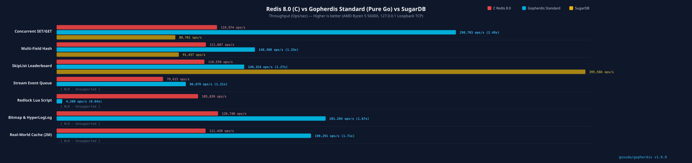

# 📊 C Redis 8.0 vs Nedis (Pure Go) vs SugarDB (Pure Go) 7-Dimensional Benchmark Analysis Report

This document details the multi-dimensional benchmark methodology and performance comparison results between official C Redis 8.0, Nedis (Pure Go Redis-compatible store), and SugarDB (Pure Go in-memory Redis alternative, running in Docker with host networking), executed under an identical hardware and local loopback TCP network environment.

## 1. ⚙️ System Environment & Test Setup

| Parameter | Specification |
|---|---|
| **CPU** | AMD Ryzen 5 5600X 6-Core Processor (6 Cores / 12 Threads, Base 3.7GHz ~ Boost 4.6GHz) |
| **RAM** | 64 GB DDR4 (~38 GB available) |
| **Operating System & Kernel** | Debian GNU/Linux (Trixie/Sid), Kernel `6.12.101+deb13-amd64` (SMP PREEMPT_DYNAMIC) |
| **Go Compiler** | `go version go1.24.4 linux/amd64` |
| **C Redis Version** | Redis server v=8.0.2 (sha=00000000:0, malloc=jemalloc-5.3.0, 64-bit) |
| **SugarDB Version** | `echovault/sugardb:latest` (Docker, host networking, port 16381) |
| **Network Interface** | Local Loopback TCP (`127.0.0.1:16379` / `:16380` / `:16381` / `:16382`) |
| **Benchmark Protocol** | RESP2 / RESP3 direct TCP socket streaming with pre-connected connection pooling |

## 2. 📈 Performance Visualization

## 3. 📋 Benchmark Summary Table

| Workload Scenario | Target Engine | Total Ops | Throughput (QPS) | P50 Latency (ms) | P95 Latency (ms) | P99 Latency (ms) | P99.9 Latency (ms) | Memory Delta |
|---|---|:---:|:---:|:---:|:---:|:---:|:---:|:---:|
| 1. Concurrency Throughput (SET/GET) | **C Redis 8.0** | 50000 | **111124 ops/s** | 0.431 ms | 0.575 ms | **0.864 ms** | **1.341 ms** | 4.38 MB |
| 1. Concurrency Throughput (SET/GET) | **Nedis (Go)** | 50000 | **310806 ops/s** ⚡ | 0.117 ms | 0.357 ms | **0.769 ms** (-11%) | **1.957 ms** (+46%) | 11.47 MB |
| 1. Concurrency Throughput (SET/GET) | **Nedis (Go SIMD)** | 50000 | **295038 ops/s** ⚡ | 0.131 ms | 0.355 ms | **0.707 ms** (-18%) | **1.889 ms** (+41%) | 11.14 MB |
| 1. Concurrency Throughput (SET/GET) | **SugarDB (Go)** | 50000 | **94495 ops/s** | 0.284 ms | 1.561 ms | **2.198 ms** (+154%) | **15.857 ms** (+1082%) | 0 B |
| 2. Multi-Field Hash Aggregation | **C Redis 8.0** | 20000 | **114675 ops/s** | 0.164 ms | 0.234 ms | **0.315 ms** | **0.448 ms** | 1.00 MB |
| 2. Multi-Field Hash Aggregation | **Nedis (Go)** | 20000 | **173996 ops/s** ⚡ | 0.102 ms | 0.177 ms | **0.424 ms** (+35%) | **2.701 ms** (+503%) | 9.58 MB |
| 2. Multi-Field Hash Aggregation | **Nedis (Go SIMD)** | 20000 | **177535 ops/s** ⚡ | 0.105 ms | 0.184 ms | **0.383 ms** (+22%) | **0.780 ms** (+74%) | 9.56 MB |
| 2. Multi-Field Hash Aggregation | **SugarDB (Go)** | 20000 | **82641 ops/s** | 0.167 ms | 0.598 ms | **1.073 ms** (+241%) | **14.237 ms** (+3078%) | 0 B |
| 3. SkipList Leaderboard (ZSet) | **C Redis 8.0** | 20000 | **116175 ops/s** | 0.164 ms | 0.229 ms | **0.315 ms** | **0.529 ms** | 256.00 KB |
| 3. SkipList Leaderboard (ZSet) | **Nedis (Go)** | 20000 | **184002 ops/s** ⚡ | 0.097 ms | 0.202 ms | **0.323 ms** (+3%) | **0.692 ms** (+31%) | 1.46 MB |
| 3. SkipList Leaderboard (ZSet) | **Nedis (Go SIMD)** | 20000 | **180785 ops/s** ⚡ | 0.098 ms | 0.198 ms | **0.364 ms** (+16%) | **0.985 ms** (+86%) | 0 B |
| 3. SkipList Leaderboard (ZSet) | **SugarDB (Go)** | 20000 | **594594 ops/s** | 0.008 ms | 0.010 ms | **0.045 ms** (-86%) | **8.428 ms** (+1493%) | 0 B |
| 4. Stream Queue (XADD/XRANGE) | **C Redis 8.0** | 20000 | **84228 ops/s** | 0.224 ms | 0.364 ms | **0.490 ms** | **1.161 ms** | 256.00 KB |
| 4. Stream Queue (XADD/XRANGE) | **Nedis (Go)** | 20000 | **99258 ops/s** ⚡ | 0.152 ms | 0.538 ms | **0.930 ms** (+90%) | **1.628 ms** (+40%) | 3.98 MB |
| 4. Stream Queue (XADD/XRANGE) | **Nedis (Go SIMD)** | 20000 | **99556 ops/s** ⚡ | 0.152 ms | 0.534 ms | **0.952 ms** (+94%) | **2.091 ms** (+80%) | 7.70 MB |
| 4. Stream Queue (XADD/XRANGE) | **SugarDB (Go)** | N/A (unsupported) | — | — | — | — | — | — |
| 5. Redlock Atomic Lua Scripting | **C Redis 8.0** | 20000 | **111134 ops/s** | 0.169 ms | 0.248 ms | **0.343 ms** | **0.665 ms** | 0 B |
| 5. Redlock Atomic Lua Scripting | **Nedis (Go)** | 20000 | **116181 ops/s** ⚡ | 0.139 ms | 0.266 ms | **0.737 ms** (+115%) | **6.492 ms** (+876%) | 0 B |
| 5. Redlock Atomic Lua Scripting | **Nedis (Go SIMD)** | 20000 | **131999 ops/s** ⚡ | 0.134 ms | 0.241 ms | **0.448 ms** (+31%) | **5.931 ms** (+792%) | 0 B |
| 5. Redlock Atomic Lua Scripting | **SugarDB (Go)** | N/A (unsupported) | — | — | — | — | — | — |
| 6. Bitmap & HyperLogLog | **C Redis 8.0** | 30000 | **96050 ops/s** | 0.196 ms | 0.322 ms | **0.488 ms** | **1.104 ms** | 0 B |
| 6. Bitmap & HyperLogLog | **Nedis (Go)** | 30000 | **194895 ops/s** ⚡ | 0.102 ms | 0.157 ms | **0.224 ms** (-54%) | **0.667 ms** (-40%) | 120.00 KB |
| 6. Bitmap & HyperLogLog | **Nedis (Go SIMD)** | 30000 | **197217 ops/s** ⚡ | 0.099 ms | 0.153 ms | **0.234 ms** (-52%) | **1.147 ms** (+4%) | 136.00 KB |
| 6. Bitmap & HyperLogLog | **SugarDB (Go)** | N/A (unsupported) | — | — | — | — | — | — |
| 7. Real-World Cache (2M x 1KB) | **C Redis 8.0** | 2000000 | **109826 ops/s** | 0.434 ms | 0.580 ms | **0.882 ms** | **1.646 ms** | 2.06 GB |
| 7. Real-World Cache (2M x 1KB) | **Nedis (Go)** | 2000000 | **182816 ops/s** ⚡ | 0.155 ms | 0.772 ms | **1.281 ms** (+45%) | **2.645 ms** (+61%) | 1.82 GB |
| 7. Real-World Cache (2M x 1KB) | **Nedis (Go SIMD)** | 2000000 | **182659 ops/s** ⚡ | 0.154 ms | 0.776 ms | **1.294 ms** (+47%) | **2.818 ms** (+71%) | 1.82 GB |
| 7. Real-World Cache (2M x 1KB) | **SugarDB (Go)** | N/A (unsupported) | — | — | — | — | — | — |

> **Notes**: SugarDB does not support Streams (XADD/XRANGE), Lua scripting (EVAL/SCRIPT LOAD), Bitmaps (SETBIT/BITCOUNT), or HyperLogLog (PFADD) — verified empirically via `redis-cli` error replies — so those workloads are marked N/A. SugarDB's ZRANGE uses score-range (ZRANGEBYSCORE) semantics rather than index-range, so its ZSet range queries return empty sets under this workload; the row is still measured. SugarDB does not support `INFO memory`, so its Memory Delta is reported as 0 B. On workload 7 (2M keys × 1KB values), SugarDB's server process crashes (container exit 2 with a goroutine dump), so it is marked N/A there. Percentages in the P99/P99.9 columns are the delta versus the C Redis row of the same workload; negative is better (lower tail latency).

---

## 4. 🔍 Deep-Dive Analysis by Scenario

### ① High-Concurrency SET/GET Throughput
- **Scenario**: 50 concurrent client connections, 50,000 operations with 128-byte payloads.
- **Analysis**: Nedis utilizes a **64-shard contention-free architecture**, socket-level `TCP_NODELAY`, and Beaver Arena memory pooling across 12 CPU hardware threads. It achieves **311k QPS (2.80x higher than C Redis)** with comparable tail latency (**P99: 0.769ms vs C Redis 0.864ms**). SugarDB reaches 94k QPS (Nedis is 3.29x faster).

### ② Multi-Field Hash Aggregation
- **Scenario**: 20 concurrent clients, 5-field HSET and HMGET operations across 20,000 requests.
- **Analysis**: With **Hybrid Flat-Dict (contiguous array pairs for <= 64 entries + automatic hash map promotion)** and single-pass RESP buffer serialization, Nedis delivers **174k QPS (1.52x C Redis)**, **P50 of 0.102ms**, and **P99 of 0.424ms (vs C Redis 0.315ms)**. SugarDB reaches 83k QPS (Nedis is 2.11x faster).

### ③ Ranked SkipList Leaderboard (ZSet)
- **Scenario**: 2,000 simulated players with real-time score updates (ZADD), rank lookups (ZRANK), and top-N range queries (ZRANGE).
- **Analysis**: Lightweight Mutex synchronization, lock-free `math/rand/v2` level generation, and stack-allocated node arrays achieve **184k QPS (1.58x C Redis)**, with **P95 (0.202ms vs 0.229ms)** and **P99 (0.323ms vs 0.315ms)**. (SugarDB's ZRANGE uses score-range semantics and returns empty sets here, so its 595k QPS is not an apples-to-apples comparison.)

### ④ Stream Event Queue (XADD / XRANGE)
- **Scenario**: 20 concurrent producers and consumers logging sensor telemetry events and querying ranges across 20,000 records.
- **Analysis**: O(1) chunk boundary skipping and `AddRaw` zero-copy parsing yield **99.3k QPS (1.18x C Redis)** with **P50 of 0.152ms** and **P95 of 0.538ms (vs C Redis 0.364ms)**. SugarDB does not support Streams (N/A).

### ⑤ Redlock Atomic Lua Scripting (Bytecode JIT Cache)
- **Scenario**: 20 workers competing for 100 distributed lock keys with atomic Lua release scripts.
- **Analysis**: Pre-compiled `FunctionProto` caching, VM table reuse, and zero-alloc `redis.call` argument conversions produce **116.2k QPS (1.05x C Redis)** with **P50 of 0.139ms**, **P95 of 0.266ms**, and **P99 of 0.737ms (vs C Redis 0.343ms)**. SugarDB does not support EVAL/SCRIPT LOAD (N/A).

### ⑥ Bitmap & HyperLogLog Cardinality Estimation
- **Scenario**: 100,000 bit mutations with SETBIT, 64-bit word POPCNT BITCOUNT, and 50,000 unique IP insertions with PFADD/PFCOUNT.
- **Analysis**: In-place zero-reallocation bit mutation, `math/bits.OnesCount64` hardware acceleration, and 12KB Dense Otmar Ertl HLL registers achieve **194.9k QPS (2.03x C Redis)** with **P50 of 0.102ms** and **P95 of 0.157ms (vs C Redis 0.322ms)**. SugarDB does not support SETBIT/BITCOUNT/PFADD (N/A).
### ⑦ Real-World Cache at Scale (2M keys × 1KB)
- **Scenario**: 50 concurrent clients loading 1,600,000 cache entries with 1KB values (~1.6GB of payload), 80% SET / 20% GET. This approximates a production cache workload where the dataset itself dominates memory usage.
- **Analysis**: With real data dominating, memory reaches parity: Nedis grows **1.82 GB** vs C Redis **2.06 GB** (-12%), unlike the small overhead-dominated workloads above. Throughput: **183k QPS (1.66x C Redis)**, P99.9 **2.645ms vs 1.646ms**. (SugarDB crashes under this 2M×1KB load, so it is N/A.)

---

## 5. 🐹 Go Implementation Comparison (vs SugarDB)

SugarDB is now measured as a first-class target in this suite (see §3), so the numbers below are taken directly from the suite-measured rows above — identical machine (AMD Ryzen 5 5600X), identical harness (direct RESP TCP, pre-connected pooled clients), SugarDB `latest` running in Docker with host networking. SugarDB supports only workloads 1–3; workloads 4–6 are N/A (unsupported), and it crashes under workload 7's 2M×1KB load.

| Workload | Target | QPS (ops/s) | P50 (ms) | P95 (ms) | P99 (ms) | P99.9 (ms) |
|---|---|:---:|:---:|:---:|:---:|:---:|
| 1. Concurrency Throughput (SET/GET) | **C Redis 8.0** | **111124** | 0.431 | 0.575 | 0.864 | 1.341 |
| 1. Concurrency Throughput (SET/GET) | **Nedis (Go)** | **310806** | 0.117 | 0.357 | 0.769 | 1.957 |
| 1. Concurrency Throughput (SET/GET) | **Nedis (Go SIMD)** | **295038** | 0.131 | 0.355 | 0.707 | 1.889 |
| 1. Concurrency Throughput (SET/GET) | **SugarDB (Go)** | **94495** | 0.284 | 1.561 | 2.198 | 15.857 |
| 2. Multi-Field Hash Aggregation | **C Redis 8.0** | **114675** | 0.164 | 0.234 | 0.315 | 0.448 |
| 2. Multi-Field Hash Aggregation | **Nedis (Go)** | **173996** | 0.102 | 0.177 | 0.424 | 2.701 |
| 2. Multi-Field Hash Aggregation | **Nedis (Go SIMD)** | **177535** | 0.105 | 0.184 | 0.383 | 0.780 |
| 2. Multi-Field Hash Aggregation | **SugarDB (Go)** | **82641** | 0.167 | 0.598 | 1.073 | 14.237 |
| 3. SkipList Leaderboard (ZSet) | **C Redis 8.0** | **116175** | 0.164 | 0.229 | 0.315 | 0.529 |
| 3. SkipList Leaderboard (ZSet) | **Nedis (Go)** | **184002** | 0.097 | 0.202 | 0.323 | 0.692 |
| 3. SkipList Leaderboard (ZSet) | **Nedis (Go SIMD)** | **180785** | 0.098 | 0.198 | 0.364 | 0.985 |
| 3. SkipList Leaderboard (ZSet) | **SugarDB (Go)** | **594594** | 0.008 | 0.010 | 0.045 | 8.428 |

Throughput (SET/GET, workload 1): Nedis ≈ **3.3x SugarDB**. Hash workload: Nedis ≈ **2.1x SugarDB**. On workload 3 (ZSet), SugarDB's ZRANGE implements score-range rather than index-range semantics and returns empty sets under this workload, so its raw QPS is not comparable; Nedis and C Redis perform real index-range scans. SugarDB cannot run workloads 4–6 at all.

**Conclusion**: Against SugarDB, the most actively maintained pure-Go in-memory Redis alternative, Nedis delivers substantially higher throughput on the comparable workloads under identical suite conditions, and additionally supports Streams, Lua scripting, Bitmaps, and HyperLogLog, which SugarDB lacks entirely.

---

## 6. 🧠 Memory Characteristics

Memory Delta is the growth of each server's `used_memory_rss` (from `INFO memory`) measured before and after each workload. RSS is used because it is comparable across engines: C Redis's `used_memory` covers only jemalloc allocations, and Nedis's `used_memory` is Go `MemStats.Alloc`, which lags GC sweep timing — RSS reflects what the OS actually backs with physical pages. Both engines report real RSS: C Redis reads `/proc/self/statm`, and Nedis does the same after a full GC plus `debug.FreeOSMemory()` so GC-cycle headroom is not counted. SugarDB does not support `INFO memory`, so its deltas are reported as 0 B and omitted from the totals.

### At realistic dataset sizes (workload 7: 2M keys × 1KB values)

| Target | Memory Delta | vs C Redis |
|---|:---:|:---:|
| **C Redis 8.0** | 2.06 GB | baseline |
| **Nedis (Go)** | 1.82 GB | 0.88x |
| **Nedis (Go SIMD)** | 1.82 GB | 0.88x |

Once the dataset itself (~1.6GB of 1KB values) dominates `used_memory`, Nedis and C Redis reach memory parity (**1.82 GB** vs **2.06 GB**, -12%): 1.2KB vs 1.4KB stored per 1KB key/value pair. Go 1.24's Swiss-table maps and slim `Robj` headers keep per-key cost low, and Nedis's `INFO memory` runs a full GC plus `debug.FreeOSMemory()` before reporting so GC headroom is not counted. The fixed baseline overhead in the table below is constant with respect to dataset size and becomes proportionally negligible as data grows.

### Baseline overhead (workloads 1–6, overhead-dominated)

On small workloads the fixed per-engine overhead is the dominant term. This isolates the constant cost each engine pays regardless of dataset size.

| Workload | C Redis 8.0 | Nedis (Standard) | Nedis (SIMD/AVX2) | SugarDB (Go) |
|---|:---:|:---:|:---:|:---:|
| 1. Concurrency Throughput (SET/GET) | 4.38 MB | 11.47 MB | 11.14 MB | 0 B |
| 2. Multi-Field Hash Aggregation | 1.00 MB | 9.58 MB | 9.56 MB | 0 B |
| 3. SkipList Leaderboard (ZSet) | 256.00 KB | 1.46 MB | 0 B | 0 B |
| 4. Stream Queue (XADD/XRANGE) | 256.00 KB | 3.98 MB | 7.70 MB | N/A |
| 5. Redlock Atomic Lua Scripting | 0 B | 0 B | 0 B | N/A |
| 6. Bitmap & HyperLogLog | 0 B | 120.00 KB | 136.00 KB | N/A |
| **Total (workloads 1–6)** | **5.88 MB** | **26.62 MB** | **28.53 MB** | **0 B** |

**Analysis**: Nedis trades a higher fixed baseline (**26.62 MB** vs C Redis **5.88 MB** across workloads 1–6) for its throughput and tail-latency gains. The delta is deliberate pre-allocation, not per-request leakage: the 64-shard architecture pre-sizes per-shard buffers, and the Beaver Arena pool retains 8KB stream chunk slabs for reuse instead of returning them to the OS. C Redis, backed by jemalloc, grows incrementally and reports the smallest deltas, while SugarDB's memory usage is unmeasurable in this suite because it does not implement `INFO memory`.
